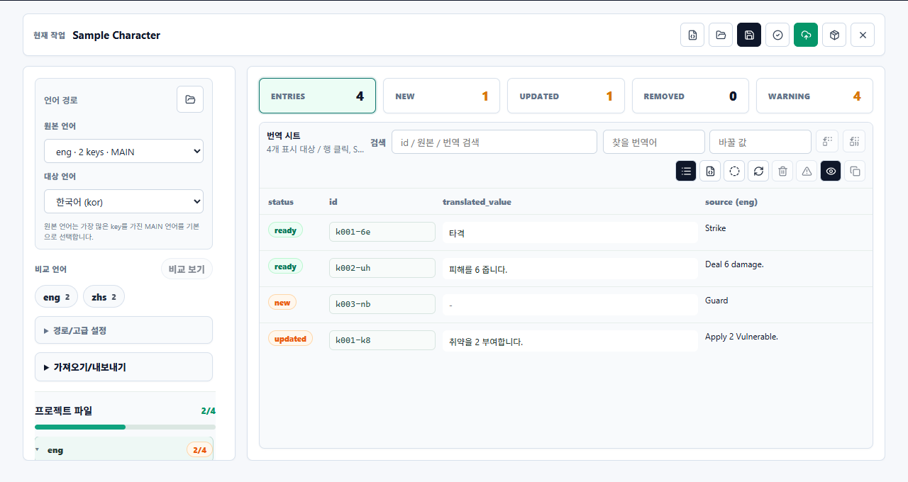

# STS2 Mod Translation Manager

Slay the Spire 2 모드 번역과 모드 관리를 돕기 위한 Windows 데스크톱 도구입니다.

현재는 **한국어 번역 워크플로우를 중심으로만 지원**합니다. 다른 언어 선택 UI가 일부 남아 있을 수 있지만, 실제로 안정적으로 다듬고 검증한 목표는 한글 번역 작업입니다.

> 이 프로젝트는 **100% 바이브 코딩으로 작성**되었습니다. 사람이 방향을 잡고, AI와 대화하며 설계, 구현, 수정, 정리를 반복한 실험적 프로젝트입니다.

## 스크린샷

### 모드 관리 대시보드


모드 상태, 변경 감지, Nexus/Vortex 감지, 번역 적용 여부를 한 화면에서 빠르게 필터링할 수 있습니다.

### 번역 워크벤치



추출한 언어 리소스를 시트 형태로 확인하고, 신규/변경/검증 경고 항목을 보면서 번역 값을 편집할 수 있습니다.

## 주요 기능

- Slay the Spire 2 모드 폴더와 외부 모드 관리 도구 후보를 감지합니다.
- 모드를 활성화/비활성화하고, 프리셋으로 저장하거나 다시 적용할 수 있습니다.
- ZIP, 7Z, PCK 등 모드 패키지에서 언어 리소스를 추출하는 흐름을 제공합니다.
- 한국어 번역 시트를 만들고, 편집하고, 검증할 수 있습니다.
- 원본 언어와 번역 값을 표 형태로 비교하며 작업할 수 있습니다.
- 번역 적용 여부, 변경 감지, 재검토 필요 상태를 모드 목록에서 확인할 수 있습니다.
- 세이브 백업, 삭제 모드 복원, 실행 상태 확인 등 안전장치를 포함합니다.

## 현재 상태

- 대상 환경: Windows
- UI: Tauri + React
- 핵심 로직: Rust
- 현재 버전: 0.0.1
- 번역 목표: 한국어 중심
- 프로젝트 성격: 개인 작업용/실험적 도구

아직 범용 모드 매니저라기보다는, Slay the Spire 2 모드를 한글로 번역하고 테스트하기 위해 만든 작업 도구에 가깝습니다.

## 예제 프롬프트

번역 시트와 함께 사용할 수 있는 예제 프롬프트를 `sample/prompt/`에 포함했습니다.

- `sample/prompt/sts2-한국어 번역.txt`: 중국어/영어 JSON 값을 한국어로 번역할 때 사용하는 기본 프롬프트
- `sample/prompt/sts2-한국어 번역 오류 수정.txt`: 검증 오류가 있는 기존 한국어 번역을 구조 보존 중심으로 고칠 때 사용하는 프롬프트

## 개발 환경

필요한 도구:

- Rust toolchain
- Node.js
- npm

의존성 설치:

```powershell
npm install
```

데스크톱 앱 개발 실행:

```powershell
npm run tauri dev
```

웹 UI 빌드:

```powershell
npm run build
```

Rust 릴리즈 빌드:

```powershell
.\scripts\build-release.ps1
```

## CLI

빌드 후 CLI 실행 파일은 아래 위치에 생성됩니다.

```text
target\release\sts2_mod_manager.exe
```

주요 명령:

```powershell
.\target\release\sts2_mod_manager.exe scan
.\target\release\sts2_mod_manager.exe ui
.\target\release\sts2_mod_manager.exe preset list
.\target\release\sts2_mod_manager.exe translation list
.\target\release\sts2_mod_manager.exe launch status
.\target\release\sts2_mod_manager.exe tools status
```

인자 없이 실행하면 CLI 도움말을 출력합니다.

## 주의

모드 파일과 세이브 파일을 다루는 도구입니다. 실제 게임 폴더에 적용하기 전에는 세이브 백업과 모드 백업을 권장합니다.

## 라이선스

MIT
